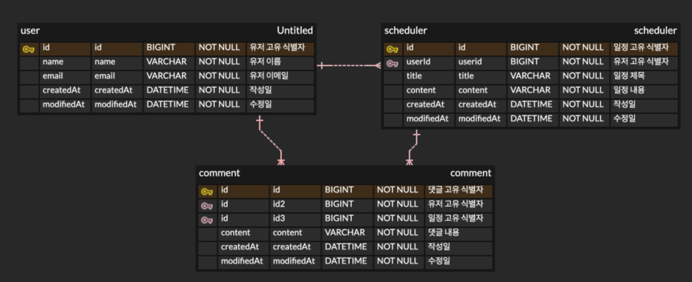

# 일정 관리 앱 만들기(숙련)

## 프로젝트 개요
Spring Boot와 JPA를 기반으로 구현된 간단한 일정 관리 앱만들기.

## 기능 구현 내용
- 일정을 등록, 전체조회, 단건조회, 수정, 삭제할 수 있다.  
- 유저를 등록 전체조회, 단건조회, 수정, 삭제할 수 있다.  
- 일정이 이제 작성 유저명 필드 대신 유저 고유 식별자 필드를 가집니다.  
- 유저에 비밀번호 필드가 추가되었습니다.  
- 이제부터 유저는 이메일과 비밀번호를 사용하여 로그인 할 수 있습니다.  
- 이제부터 일정은 로그인 상태에서만 작성이 가능합니다.  
- 일정 수정, 일정 삭제는 본인의 것만 수정, 삭제가 가능합니다.  
- 일정 수정, 일정 삭제는 본인의 것만 수정, 삭제가 가능합니다.  
- 일정 작성, 수정 시 제목, 내용을 필수값으로 적용하고 내용은 100자 이하로 작성하게 적용했습니다.  
- 유저 생성, 수정 시 이름에 글자수 5자 이하 제한, 이메일 형식 도입, 패스워드 사이즈 8자 이상 15자 이하로 적용했습니다.  
- 다양한 예외처리 클래스를 구현하여 상황에 맞게 적용했습니다.  
- 클라이언트가 유효성 검사 실패 ,예외처리를 확인 할 수 있습니다.
- 유저 생성 시 비밀번호를 암호화해서 저장합니다.
- 로그인 시 암호화 된 패스워드도 검증하여 로그인합니다.
- 생성된 일정에 댓글을 달 수 있고 생성된 댓글 전체 조회를 할 수 있습니다.
- 생성된 일정을 페이징하여 조회 할 수 있습니다.

##  기술 스택
- **Language:** Java
- **Framework:** Spring Boot
- **Data:** Spring Data JPA
- **Database:** MySQL

---
## API 명세서

## Lv1 일정 CRUD API 명세서

### 1. 일정 생성

- **Method:** POST
- **URL:** /api/schedulers
- **Description:** 새로운 일정을 생성합니다.
- 🩹fix(유저와의 연관관계를 위해 기존 name 필드 삭제,userId 필드로 수정,제목 필수입력 제한,내용 글자수 제한 추가)
- **Request:**

  | 필드명       | 타입     | 필수 여부 | 설명        |
  |:----------|:-------|:-----:|:----------|
  | `userId`  | Long   |   O   | 유저 고유 식별자 |
  | `title`   | String |   O   | 할일 제목     |
  | `content` | String |   O   | 할일 내용     |

```json
{
  "userId": 1,
  "title": "과제작성",
  "content": "과제를 해야한다."
}
```
- **Response:**

  | 필드명           | 타입     | 필수 여부 | 설명                 |
  |:--------------|:-------|:-----:|:-------------------|
  | `id`          | Long   |   O   | 일정 고유 식별자          |
  | `userId`      | Long   |   O   | 유저 고유 식별자          |
  | `title`       | String |   O   | 할일 제목              |
  | `content`     | String |   O   | 할일 내용              |
  | `createdAt`   | String |   O   | 작성일 (JPA Auditing) |
  | `modifieddAt` | String |   O   | 수정일 (JPA Auditing) |

```json
{
  "id": 1,
  "userId": 1,
  "title": "과제작성",
  "content":"과제를 해야한다.",
  "createdAt": "2026-04-16T17:30:30",
  "modifiedAt": "2026-04-16T17:30:30"
}
```
### 2. 일정 전체 조회

- **Method:** GET
- **URL:** /api/schedulers
- **Description:** 등록된 모든 일정을 조회합니다.
- 🩹fix(유저와의 연관관계에 의해 기존 name 필드에서,userId 필드가 반환)
- 배열을 감싼 객체 형태로 조회합니다
- **Request:** 없음
- **Response:**

  | 필드명              | 타입     | 필수 여부 | 설명                 |
  |:-----------------|:-------|:-----:|:-------------------|
  | `schedulerList`  | Array  |   O   | 일정 데이터 배열          |
  | `[].id`          | Long   |   O   | 일정 고유 식별자          |
  | `[].userId`      | Long   |   O   | 유저 고유 식별자          |
  | `[].title`       | String |   O   | 할일 제목              |
  | `[].content`     | String |   O   | 할일 내용              |
  | `[].createdAt`   | String |   O   | 작성일 (JPA Auditing) |
  | `[].modifieddAt` | String |   O   | 수정일 (JPA Auditing) |

```json
{
  "schedulerList": [
    {
      "id": 1,
      "userId": 1,
      "title": "페이징테스트용7",
      "content": "페이징테스트용7",
      "createdAt": "2026-04-23T11:06:04.908662",
      "modifiedAt": "2026-04-23T11:06:04.908662"
    }
  ]
}
```

### 3. 일정 페이징 조회

- **Method:** GET
- **URL:** /api/schedulers/page
- **Description:** 일정을 수정일 기준 내림차순으로 페이징하여 조회합니다.
- 배열을 감싼 객체 형태로 조회합니다
- **Request:** Query Parameters ex)URL: /api/schedules/page?page=0&size=10
- **Response:** 공통 PageResponse 사용

  | 필드명                      | 타입      | 필수 여부 | 설명                 |
    |:-------------------------|:--------|:-----:|:-------------------|
  | `results`                | Array   |   O   | 페이징된 일정 데이터 배열     |
  | `results[].title`        | String  |   O   | 일정 제목              |
  | `results[].content`      | String  |   O   | 일정 내용              |
  | `results[].commentCount` | Long    |   O   | 해당 일정에 댓글 수        |
  | `results[].createdAt`    | String  |   O   | 작성일 (JPA Auditing) |
  | `results[].modifiedAt`   | String  |   O   | 수정일 (JPA Auditing) |
  | `results[].userName`     | String  |   O   | 작성 유저명             |
  | `currentPage`            | int     |   O   | 현재 페이지 번호          |
  | `totalPage`              | int     |   O   | 전체 페이지 수           |
  | `totalElements`          | Long    |   O   | 전체 데이터 수           |
  | `last`                   | bollean |   O   | 마지막 페이지 여부         |

```json
{
  "results": [
    {
      "title": "페이징테스트용7",
      "content": "페이징테스트용7",
      "commentCount": 1,
      "createdAt": "2026-04-23T11:06:04.908662",
      "modifiedAt": "2026-04-23T11:06:04.908662",
      "userName": "강재구"
    }
  ],
  "currentPage": 0,
  "totalPage": 1,
  "totalElements": 1,
  "last": true
}
```

### 4. 일정 단건 조회

- **Method:** GET
- **URL:** /api/schedulers/{id}
- **Description:**  특정 ID의 일정을 상세 조회합니다.
- 🩹fix(유저와의 연관관계에 의해 기존 name 필드에서,userId 필드가 반환)
- **Request:** Path Variable {id} (api/schedules/1) 
  - id (Long): 조회할 일정의 고유 ID
- **Response:**

  | 필드명           | 타입     | 필수 여부 | 설명                 |
    |:--------------|:-------|:-----:|:-------------------|
  | `id`          | Long   |   O   | 일정 고유 식별자          |
  | `userId`      | Long   |   O   | 유저 고유 식별자          |
  | `title`       | String |   O   | 할일 제목              |
  | `content`     | String |   O   | 할일 내용              |
  | `createdAt`   | String |   O   | 작성일 (JPA Auditing) |
  | `modifieddAt` | String |   O   | 수정일 (JPA Auditing) |

```json
{
  "id": 1,
  "userId": 1,
  "title": "과제작성",
  "content":"과제를 해야한다.",
  "createdAt": "2026-04-16T17:30:30",
  "modifiedAt": "2026-04-16T17:30:30"
}
```

### 5. 일정 수정

- **Method:** PATCH
- **URL:** /api/schedulers/{id}
- **Description:** 선택한 일정을 수정합니다.
- 🩹fix(유저와의 연관관계에 의해 기존 name 필드 삭제, 제목 필수입력 제한,내용 글자수 제한 추가)
- **Request:**

  | 필드명       | 타입     | 필수 여부 | 설명     |
    |:----------|:-------|:-----:|:-------|
  | `title`   | String |   X   | 수정할 제목 |
  | `content` | String |   X   | 수정할 내용 |

```json
{
  "name": "강재구",
  "title": "과제작성중",
  "content": "Lv 0. 과제 작성중."
}
```
- **Response:**

  | 필드명           | 타입     | 필수 여부 | 설명                 |
    |:--------------|:-------|:-----:|:-------------------|
  | `id`          | Long   |   O   | 일정 고유 식별자          |
  | `userId`      | Long   |   O   | 작성자 고유 식별자         |
  | `title`       | String |   X   | 수정된 제목             |
  | `content`     | String |   X   | 수정된 내용             |
  | `createdAt`   | String |   O   | 작성일 (JPA Auditing) |
  | `modifieddAt` | String |   O   | 수정일 (JPA Auditing) |

```json
{
  "id": 1,
  "userId": 1,
  "title": "과제작성중",
  "content":"Lv 0. 과제 작성중.",
  "createdAt": "2026-04-16T17:30:30",
  "modifiedAt": "2026-04-16T17:40:30"
}
```

### 6. 일정 삭제

- **Method:** DELETE
- **URL:** /api/schedulers/{id}
- **Description:** 선택한 일정을 삭제합니다.
- **Request:** Path Variable {id} (api/schedules/1)
- **Response:** 본문 없음

## Lv2 유저 CRUD API 명세서

### 1. 유저 생성

- **Method:** POST
- **URL:** /api/users
- **Description:** 새로운 유저를 생성합니다.
- 🩹fix(비밀번호 필드 추가,비밀번호를 암호화 하여 저장,이름 글자수 제한,이메일 형식 제한, 패스워드 글자수 제한 추가)
- **Request:**

  | 필드명        | 타입     | 필수 여부 | 설명      |
  |:-----------|:-------|:-----:|:--------|
  | `name`     | String |   O   | 유저 이름   |
  | `email`    | String |   O   | 유저 이메일  |
  | `password` | String |   O   | 유저 비밀번호 |
  

```json
{
  "name": "강재구",
  "email": "rkdworn8@gmail.com",
  "password": "12345678"
}
```
- **Response:**

  | 필드명           | 타입     | 필수 여부 | 설명                 |
    |:--------------|:-------|:-----:|:-------------------|
  | `id`          | Long   |   O   | 유저 고유 식별자          |
  | `name`        | String |   O   | 유저 이름              |
  | `title`       | String |   O   | 유저 이메일             |
  | `createdAt`   | String |   O   | 작성일 (JPA Auditing) |
  | `modifieddAt` | String |   O   | 수정일 (JPA Auditing) |

```json
{
  "id": 1,
  "name": "강재구",
  "email": "rkdworn@gmail.com",
  "createdAt": "2026-04-16T17:30:30",
  "modifiedAt": "2026-04-16T17:30:30"
}
```

### 2. 로그인
- **Method:** POST
- **URL:** /api/users/login
- **Description:** 이메일과 비밀번호를 확인하여 일치할 경우 세션을 발급합니다.
- **Request:**

  | 필드명        | 타입     | 필수 여부 | 설명      |
    |:-----------|:-------|:-----:|:--------|
  | `email`    | String |   O   | 유저 이메일  |
  | `password` | String |   O   | 유저 비밀번호 |

```json
{
"email": "rkdworn8@gmail.com",
"password": "12345678"
}
```
- **Response:**
- **Body:** 본문없음
- **Header:** Set-Cookie: JSESSIONID=...(세션 발급)

### 3. 유저 전체 조회

- **Method:** GET
- **URL:** /api/users
- **Description:** 등록된 모든 유저를 조회합니다.
- 배열을 감싼 객체 형태로 조회합니다.
- **Request:** 없음
- **Response:**

  | 필드명              | 타입     | 필수 여부 | 설명                 |
    |:-----------------|:-------|:-----:|:-------------------|
  | `userList`       | Array  |   O   | 유저 데이터 배열          |
  | `[].id`          | Long   |   O   | 유저 고유 식별자          |
  | `[].name`        | String |   O   | 유저 이름              |
  | `[].title`       | String |   O   | 유저 이메일             |
  | `[].createdAt`   | String |   O   | 작성일 (JPA Auditing) |
  | `[].modifieddAt` | String |   O   | 수정일 (JPA Auditing) |

```json
{
  "userList": [
    {
      "id": 1,
      "name": "강재구",
      "email": "rkdworn8@gmail.com",
      "createdAt": "2026-04-23T11:05:56.019755",
      "modifiedAt": "2026-04-23T11:05:56.019755"
    }
  ]
}
```

### 4. 유저 단건 조회

- **Method:** GET
- **URL:** /api/users/{id}
- **Description:**  특정 ID의 유저를 상세 조회합니다.
- **Request:** Path Variable {id} (api/users/1)
  - id (Long): 조회할 유저의 고유 ID
- **Response:**

  | 필드명           | 타입     | 필수 여부 | 설명                 |
      |:--------------|:-------|:-----:|:-------------------|
  | `id`          | Long   |   O   | 유저 고유 식별자          |
  | `name`        | String |   O   | 유저 이름              |
  | `email`       | String |   O   | 유저 이메일             |
  | `createdAt`   | String |   O   | 작성일 (JPA Auditing) |
  | `modifieddAt` | String |   O   | 수정일 (JPA Auditing) |

```json
{
  "id": 1,
  "name": "강재구",
  "email": "rkdworn@gmail.com",
  "createdAt": "2026-04-16T17:30:30",
  "modifiedAt": "2026-04-16T17:30:30"
}
```

### 5. 유저 수정

- **Method:** PATCH
- **URL:** /api/users/{id}
- **Description:** 선택한 유저의 정보를 수정합니다.
- **Request:**

  | 필드명     | 타입     | 필수 여부 | 설명         |
    |:--------|:-------|:-----:|:-----------|
  | `name`  | String |   O   | 수정할 유저 이름  |
  | `email` | String |   O   | 수정할 유저 이메일 |

```json
{
  "name": "강재구MK2",
  "email": "rkdwornmk2@gmail.com"
}
```
- **Response:**

  | 필드명           | 타입     | 필수 여부 | 설명                 |
        |:--------------|:-------|:-----:|:-------------------|
  | `id`          | Long   |   O   | 유저 고유 식별자          |
  | `name`        | String |   O   | 수정된 유저 이름          |
  | `email`       | String |   O   | 수정된 유저 이메일         |
  | `createdAt`   | String |   O   | 작성일 (JPA Auditing) |
  | `modifieddAt` | String |   O   | 수정일 (JPA Auditing) |

```json
{
  "id": 1,
  "name": "강재구MK2",
  "email": "rkdwornmk2@gmail.com",
  "createdAt": "2026-04-16T17:30:30",
  "modifiedAt": "2026-04-16T18:30:30"
}
```

### 6. 유저 삭제

- **Method:** DELETE
- **URL:** /api/users/{id}
- **Description:** 선택한 유저를 삭제합니다.
- **Request:** Path Variable {id} (api/users/1)
- **Response:** 본문 없음

## Lv7 댓글 CRUD API 명세서

### 1. 댓글 생성

- **Method:** POST
- **URL:** /api/comments
- **Description:** 특정 일정에 새로운 댓글을 생성합니다.
- **Request:**

  | 필드명          | 타입     | 필수 여부 | 설명        |
    |:-------------|:-------|:-----:|:----------|
  | `scheduleId` | Long   |   O   | 일정 고유 식별자 |
  | `content`    | String |   O   | 댓글 내용     |


```json
{
  "scheduleId": 1,
  "content": "댓글테스트"
}
```
- **Response:**

  | 필드명           | 타입     | 필수 여부 | 설명                 |
      |:--------------|:-------|:-----:|:-------------------|
  | `id`          | Long   |   O   | 댓글 고유 식별자          |
  | `scheduleId`  | String |   O   | 일정 고유 식별자          |
  | `userId`      | String |   O   | 유저 고유 식별자          |
   | `content`     | String |   O   | 댓글 내용              |
  | `createdAt`   | String |   O   | 작성일 (JPA Auditing) |
  | `modifieddAt` | String |   O   | 수정일 (JPA Auditing) |

```json
{
  "id": 1,
  "scheduleId": 1,
  "userId": 1,
  "content": "댓글 테스트용",
  "createdAt": "2026-04-22T23:45:00",
  "modifiedAt": "2026-04-22T23:45:00"
}
```

### 2. 댓글 전체 조회

- **Method:** GET
- **URL:** /api/comments
- **Description:** 등록된 모든 댓글을 조회합니다.
- 배열을 감싼 객체형태로 반환
- **Request:** 없음
- **Response:**

  | 필드명              | 타입     | 필수 여부 | 설명                 |
    |:-----------------|:-------|:-----:|:-------------------|
  | `commentList`    | Array  |   O   | 댓글 데이터 배열          |
  | `[].id`          | Long   |   O   | 댓글 고유 식별자          |
  | `[].userId`      | Long   |   O   | 유저 고유 식별자          |
  | `[].schedulerId` | Long   |   O   | 일정 고유 식별자          |
  | `[].content`     | String |   O   | 댓글 내용              |
  | `[].createdAt`   | String |   O   | 작성일 (JPA Auditing) |
  | `[].modifieddAt` | String |   O   | 수정일 (JPA Auditing) |

```json
{
  "commentList": [
    {
      "id": 1,
      "userId": 1,
      "schedulerId": 1,
      "content": "댓글등록테스트2",
      "createdAt": "2026-04-23T11:06:10.525637",
      "modifiedAt": "2026-04-23T11:06:10.525637"
    }
  ]
}
```

##  ERD

### Entity Relationship Diagram

